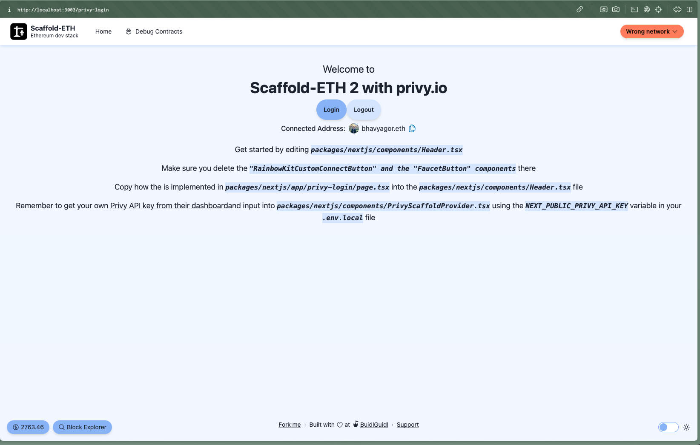

# Privy extension



This Scaffold-ETH 2 extension comes pre-configured with [privy.io](https://privy.io/), providing an example to help you get started quickly. Follow the steps below to set up and start using the extension.

## Installation

1. Create a new project with Privy Widget:

```bash
npx create-eth@latest -e @bhavyagor12/privy-widget
```

2. Configure environment variables:

Create the file `packages/nextjs/.env.local` and copy the contents of `packages/nextjs/.env.example` into it.

3. Get your PRIVY APP ID:

Visit the Privy Docs to get your APP ID: https://dashboard.privy.io and add it to `packages/nextjs/.env.local`

> **Note:** Make sure to update the API key into the 'NEXT_PUBLIC_PRIVY_API_KEY' variable

## Documentation

For more detailed information and usage visit: https://docs.privy.io/ 
